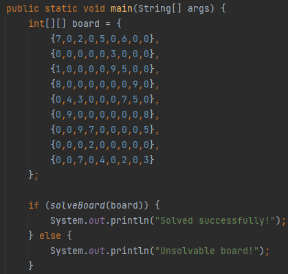
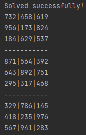
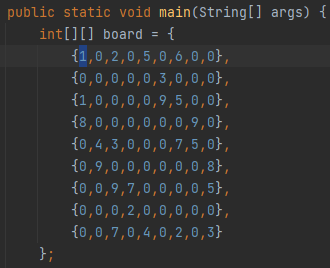
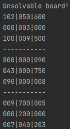

# Sudoku Solver in Java

## Description
This Sudoku Solver program was a result of following this tutorial:
[Create a Sudoku Solver In Java In 20 Minutes - Full Tutorial](https://www.youtube.com/watch?v=mcXc8Mva2bA).

I wanted to learn how to create a logic game in Java. I learned how backtracking and recursion is used for logic games, like Sudoku.

I added detailed comments to ensure I understood the line(s) of code.

In several occasions, I tried to write out blocks of code by myself before continuing with the tutorial. 
This helps me learn from my logical oversights and realize more effective implementations.

## Screenshots
The initial board is passed in via a 2D array:
<figure style="text-align:center">
  
</figure>

The solved board is printed out to the console:
<figure style="text-align:center">
  
</figure>

If the initial board passed in is unsolvable (e.g. the first number is changed to a 1, which is also seen in the same column)...:
<figure style="text-align:center">
  
</figure>

... then the unsolvable board is printed out to the console:
<figure style="text-align:center">
  
</figure>
